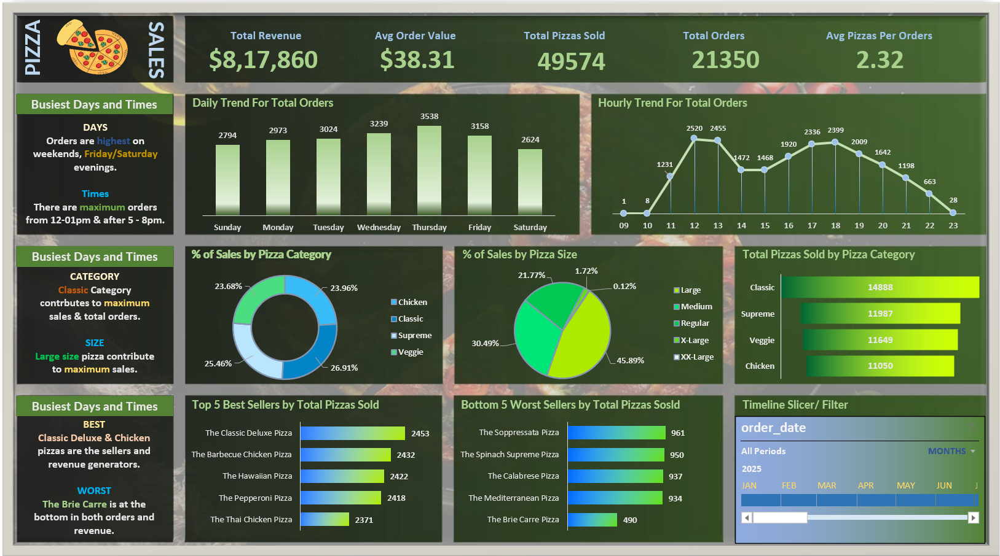

# 🍕 Pizza Sales Analytics Dashboard


---

# 📌 Project Overview

The **Pizza Sales Analytics Dashboard** is a Data Analytics project that analyzes restaurant sales data using **SQL Server** and **Microsoft Excel**.

The objective of this project is to transform raw sales data into meaningful business insights by calculating Key Performance Indicators (KPIs), identifying sales trends, and building an interactive dashboard for decision-making.

---

# 🎯 Business Problem

Restaurant businesses generate thousands of transactions every month. Without proper analysis, it becomes difficult to answer questions such as:

- Which pizzas generate the highest revenue?
- Which pizza categories perform the best?
- What are the busiest ordering hours?
- Which pizza sizes contribute the most sales?
- Which products should be promoted?

This project solves these challenges through SQL-based analysis and an interactive Excel dashboard.

---

# 🎯 Objectives

- Calculate important business KPIs
- Analyze daily and hourly sales trends
- Identify Top 5 and Bottom 5 selling pizzas
- Analyze sales by pizza category
- Analyze sales by pizza size
- Build an interactive Excel Dashboard
- Generate business insights and recommendations

---

# 🛠️ Tools & Technologies

- SQL Server
- SQL
- Microsoft Excel
- Pivot Tables
- Pivot Charts
- Slicers
- Data Visualization

---

# 📂 Dataset

The dataset contains transactional pizza sales information including:

- Order ID
- Order Date
- Order Time
- Pizza Name
- Pizza Category
- Pizza Size
- Quantity
- Unit Price
- Total Price

---

# 📊 Key Performance Indicators (KPIs)

| KPI | Description |
|------|-------------|
| 💰 Total Revenue | Total sales generated |
| 🛒 Total Orders | Number of customer orders |
| 🍕 Total Pizzas Sold | Total pizzas sold |
| 💵 Average Order Value | Revenue per order |
| 📦 Average Pizzas per Order | Average pizzas purchased in one order |

---

# 📈 Dashboard Features

✔ KPI Cards

✔ Daily Sales Trend

✔ Hourly Sales Trend

✔ Sales by Pizza Category

✔ Sales by Pizza Size

✔ Top 5 Best Selling Pizzas

✔ Bottom 5 Selling Pizzas

✔ Interactive Timeline Filter

---

# 📷 Dashboard Preview


---

# 📊 SQL Analysis

The project uses SQL queries to calculate:

- Total Revenue
- Average Order Value
- Total Orders
- Total Pizzas Sold
- Average Pizzas Per Order
- Daily Order Trend
- Hourly Order Trend
- Sales by Pizza Category
- Sales by Pizza Size
- Top 5 Best Sellers
- Bottom 5 Sellers

---

# 📈 Business Insights

- Thursday records the highest number of customer orders.
- Lunch (12 PM–1 PM) and evening (5 PM–8 PM) are the busiest ordering hours.
- Large-sized pizzas generate the highest revenue.
- Classic category contributes the largest share of total sales.
- A small number of pizzas consistently outperform others in sales.

---

# 💡 Business Recommendations

- Increase staffing during peak ordering hours.
- Maintain higher inventory for best-selling pizzas.
- Promote low-selling pizzas using discounts and combo offers.
- Focus marketing campaigns on high-performing categories.
- Introduce seasonal offers during slow sales periods.

---

# 📁 Project Structure

```text
Pizza-Sales-Analytics/
│
├── Dataset/
│   └── pizza_sales.csv
│
├── SQL/
│   └── Pizza Sales SQL Queries.sql
|   └── PIZZA SALES SQL QUERIES.pdf
│
├── Excel/
│   └── Pizza_Sales_Dashboard.xlsx
│
├── Images/
│   └── dashboard.png
|   └── Background.jpg
│
├── README.md
│
└── LICENSE
```

---

# 🚀 How to Use

1. Download the dataset.
2. Import the dataset into SQL Server.
3. Execute the SQL queries.
4. Open the Excel dashboard.
5. Refresh Pivot Tables if required.
6. Explore the dashboard using Timeline and Filters.

---

# 📌 Skills Demonstrated

- SQL
- Data Cleaning
- Data Analysis
- KPI Analysis
- Business Intelligence
- Microsoft Excel
- Pivot Tables
- Pivot Charts
- Dashboard Design
- Data Visualization

---

# 📜 Future Improvements

- Power BI Dashboard
- Tableau Dashboard
- Python Automation
- Sales Forecasting
- Customer Segmentation
- Machine Learning Prediction

---

# 👨‍💻 Author

**Deep**

# ⭐ If you found this project useful, consider giving it a Star!
